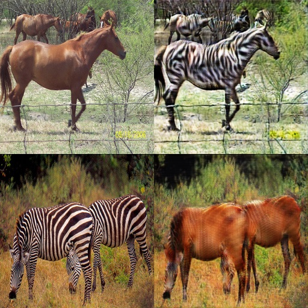

# CycleGAN-TF
CycleGAN implementation for TensorFlow

original page:https://junyanz.github.io/CycleGAN/

original paper: https://arxiv.org/pdf/1703.10593.pdf

original implementation: https://github.com/junyanz/pytorch-CycleGAN-and-pix2pix

## usage
Add named folder dataA, dataB, valA and valB. dataA and dataB are used for training. valA and valB are used for test.

like this
```
main.py
pred.py
dataA
  ├ 000.jpg
  ├ aaa.png
  ...
  └ zzz.jpg
dataB
  ├ 111.jpg
  ├ bbb.png
  ...
  └ xxx.jpg
valA
  ├ 222.jpg
  ├ ccc.png
  ...
  └ yyy.jpg 
valB
  ├ 333.jpg
  ├ ddd.png
  ...
  └ www.jpg 
```

To train

```
python main.py
```

To Validate

```
python test.py valA valB
```

## Result examples
upper left: inputA

upper right: converted AtoB

under left: inputB

under right; converted BtoA


